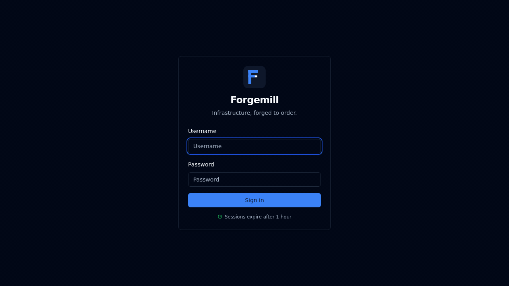

# Forgemill

**Infrastructure, forged to order.**

Self-hosted VM deployment and lifecycle management for VMware vCenter, ESXi, and Proxmox VE — one web UI, one REST API, one CLI.

[](https://go.dev)
[](https://react.dev)
[](https://www.typescriptlang.org)
[](./LICENSE)



Forgemill is a self-hosted platform that brings template building, VM deployment, lifecycle management, and post-deploy automation behind a single modern interface. Point it at your hypervisors, build golden templates from ISO with Packer, deploy VMs with cloud-init, and run SSH-based actions against your fleet — all from the same app.

## Table of contents

- [Who it's for](#who-its-for)
- [Features at a glance](#features-at-a-glance)
- [Supported hypervisors](#supported-hypervisors)
- [Supported OS templates](#supported-os-templates-factory-builder)
- [Quick start](#quick-start)
- [Updating](#updating)
- [Configuration](#configuration)
- [Features](#features)
- [Built-in actions](#built-in-actions)
- [CLI tool](#cli-tool)
- [API overview](#api-overview)
- [Architecture](#architecture)
- [Security](#security)
- [Project structure](#project-structure)
- [Contributing](#contributing)
- [License](#license)

---

## Who it's for

- **Homelab operators** who want more than the stock Proxmox/ESXi UI without the weight of vRealize/Morpheus.
- **Small platform teams** who need template building, bulk deploys, and repeatable provisioning across a few hypervisors.
- **Internal IT shops** who want a single web UI that their engineers (not just the vCenter admin) can use safely, with role-based access and an audit log.

If you already run full-blown cloud platforms or need multi-tenancy, Forgemill is not trying to be that.

## Features at a glance

- **Multi-hypervisor** — vCenter, standalone ESXi, Proxmox VE, behind a unified API
- **Template Factory** — ISO-to-template pipeline with Packer; versioning, scheduled rebuilds, update detection on ISO checksum change
- **One-click deploy** — cloud-init customisation, bulk deploys, reusable blueprints
- **Lifecycle in one place** — power, snapshots, resize, disk expand, console, credential reveal
- **Post-deploy actions** — reusable bash scripts run over SSH with streaming output, parameters, and execution history
- **In-app notifications** — bell + drawer for deploy / execution / build / template-update events
- **Auth that scales** — local accounts, LDAP / AD with group→role mapping, per-user API keys, JWT with revocation
- **Webhooks + audit log** — HMAC-signed webhooks for external systems, comprehensive audit trail for compliance
- **Runs as one container** — single Docker image, SQLite-backed, no external services required

## Supported hypervisors

| Hypervisor | Transport | Notes |
|------------|-----------|-------|
| **VMware vCenter** | govmomi (vSphere API) | Full VM lifecycle, folders, clusters, resource pools, native templates |
| **VMware ESXi (standalone)** | govmomi (direct host) | VM lifecycle, snapshots, resize. No folders / native templates without vCenter |
| **Proxmox VE** | Proxmox REST API | KVM/QEMU VMs, snapshots, cloning, templates, resize. Ticket or API-token auth |

## Supported OS templates (Factory builder)

Built-in installer definitions generate the Packer HCL + installer config automatically. Additional distros can be added — see [docs/ADDING_OS_DEFINITIONS.md](./docs/ADDING_OS_DEFINITIONS.md).

| OS | Version | Arch | Installer |
|----|---------|------|-----------|
| **Ubuntu 24.04 LTS** | Noble Numbat | amd64 | cloud-init autoinstall |
| **Ubuntu 22.04 LTS** | Jammy Jellyfish | amd64 | cloud-init autoinstall |
| **Rocky Linux 9** | Blue Onyx | x86_64 | Kickstart |
| **Rocky Linux 8** | Green Obsidian | x86_64 | Kickstart |

Already-built templates from any hypervisor can be *imported* and deployed regardless of OS — the list above is specifically for the **Factory builder** (Packer-driven template creation). If you just want to deploy from an existing template you synced from vCenter/Proxmox, any guest OS works.

---

## Quick start

Three ways to run Forgemill, from simplest to most flexible.

### Option 1: Plain Docker run (simplest)

```bash
docker run -d \
  --name forgemill \
  -p 8080:8080 \
  -v forgemill-data:/app/data \
  -e FORGEMILL_JWT_SECRET="$(openssl rand -hex 32)" \
  -e FORGEMILL_ENCRYPTION_KEY="$(openssl rand -hex 32)" \
  -e FORGEMILL_ADMIN_PASSWORD="your-admin-password" \
  ghcr.io/blink-zero/forgemill:latest
```

Open `http://localhost:8080` and sign in with `admin` / your chosen password.

### Option 2: Pre-built image with Docker Compose (recommended)

```bash
mkdir forgemill && cd forgemill

# Pull the production compose file
curl -fsSL https://raw.githubusercontent.com/blink-zero/forgemill/main/docker-compose.prod.yml \
  -o docker-compose.prod.yml

# Create secret files (optional but recommended for production)
mkdir -p secrets
openssl rand -hex 32 > secrets/jwt_secret.txt
openssl rand -hex 32 > secrets/encryption_key.txt
echo "your-admin-password" > secrets/admin_password.txt

docker compose -f docker-compose.prod.yml up -d
```

### Option 3: Build from source (for developers)

```bash
git clone https://github.com/blink-zero/forgemill.git
cd forgemill

mkdir -p secrets
openssl rand -hex 32 > secrets/jwt_secret.txt
openssl rand -hex 32 > secrets/encryption_key.txt
echo "your-admin-password" > secrets/admin_password.txt

docker compose up -d --build
```

If no admin password was set, a random one is printed to the container logs:

```bash
docker logs forgemill 2>&1 | grep "Admin password"
```

---

## Updating

Data is preserved across updates. Migrations run automatically on startup.

```bash
docker compose -f docker-compose.prod.yml pull
docker compose -f docker-compose.prod.yml up -d
```

For plain `docker run`, stop and remove the container, then run with the new image. The named volume (`forgemill-data`) preserves your database, secrets, and build artifacts.

---

## Configuration

All configuration is via environment variables. For sensitive values, Forgemill supports Docker secrets via `_FILE` variants.

| Variable | Default | Description |
|----------|---------|-------------|
| `FORGEMILL_LISTEN_ADDR` | `:8080` | HTTP server bind address |
| `FORGEMILL_DB_PATH` | `/app/data/forgemill.db` | SQLite database file path |
| `FORGEMILL_DATA_DIR` | `/app/data` | Data directory for builds and artifacts |
| `FORGEMILL_JWT_SECRET` | *(auto-generated)* | JWT signing key (32+ characters recommended) |
| `FORGEMILL_JWT_SECRET_FILE` | – | Path to file containing JWT secret |
| `FORGEMILL_JWT_EXPIRY` | `1h` | JWT token expiration (`30m`, `2h`, max 24h) |
| `FORGEMILL_ENCRYPTION_KEY` | *(auto-generated)* | AES encryption key for secrets at rest |
| `FORGEMILL_ENCRYPTION_KEY_FILE` | – | Path to file containing encryption key |
| `FORGEMILL_ADMIN_USER` | `admin` | Initial admin account username |
| `FORGEMILL_ADMIN_PASSWORD` | *(random)* | Initial admin account password |
| `FORGEMILL_ADMIN_PASSWORD_FILE` | – | Path to file containing admin password |
| `FORGEMILL_LOG_LEVEL` | `info` | `debug`, `info`, `warn`, `error` |
| `FORGEMILL_CORS_ORIGINS` | *(empty)* | Comma-separated allowed CORS origins |
| `FORGEMILL_TLS_CERT` | – | Path to TLS certificate for native HTTPS |
| `FORGEMILL_TLS_KEY` | – | Path to TLS private key |
| `FORGEMILL_TRUSTED_PROXIES` | – | Comma-separated trusted reverse proxy IPs |
| `FORGEMILL_ALLOW_PRIVATE_WEBHOOKS` | `false` | Allow webhook delivery to private/RFC1918 IPs |
| `FORGEMILL_FRONTEND_PATH` | `./frontend/dist` | Path to built frontend assets |

### Docker secrets (optional)

For production deployments, use Docker secrets instead of environment variables. The `_FILE` variants read the value from a file:

```yaml
environment:
  FORGEMILL_JWT_SECRET_FILE: /run/secrets/jwt_secret
  FORGEMILL_ENCRYPTION_KEY_FILE: /run/secrets/encryption_key
  FORGEMILL_ADMIN_PASSWORD_FILE: /run/secrets/admin_password
secrets:
  jwt_secret:
    file: ./secrets/jwt_secret.txt
```

This prevents secrets from appearing in `docker inspect` output or process listings. Environment variables still work and take precedence if both are set.

---

## Features

### Multi-hypervisor support
- VMware vCenter / vSphere via govmomi
- Proxmox VE via REST API (ticket + API-token auth)
- VMware ESXi direct host management without vCenter

### VM deployment
- Template-based cloning with customization specs
- Real-time progress streaming over WebSocket
- Configurable CPU, memory, disk, network, datastore
- Resource pool and folder placement (vSphere)
- Cloud-init: hostname, SSH keys, password, user-data injection
- Platform-aware advanced options with smart defaults per hypervisor

### VM lifecycle management
- Power operations: start, stop, restart, suspend
- Snapshot management: create, revert, delete
- Live resource resizing: CPU, memory, disk expansion
- Web console access (noVNC / VMRC)
- Managed VM inventory with live status tracking
- Reveal deploy credentials (AES-256 at rest, decrypted only on reveal, syntax-highlighted for readability)

### Blueprints and bulk deployment
- Save deployment configurations as reusable blueprints
- Deploy many VMs in one operation with name-pattern expansion
- Per-VM network configuration overrides

### Post-deploy actions
- Reusable automation scripts that run over SSH on deployed VMs
- Parameterised actions (string / number / select / boolean / password)
- Real-time execution output streaming via WebSocket
- Execution history with redacted secrets in logs
- Merge actions into cloud-init user-data for zero-touch provisioning
- See [Built-in actions](#built-in-actions) below for what ships in the box

### In-app notifications
- Bell icon in the top bar with a per-user unread count
- Automatic events: deploy completed/failed, action execution completed/failed, template rebuild completed, template update available (admins)
- Mark-one-read, mark-all-read, dismiss, deep-link to the relevant page
- Automatic 30-day retention for read notifications

### Template Factory (Packer integration)
- ISO-to-template pipeline: Forgemill generates Packer HCL + installer configs automatically
- Built-in OS definitions with an extensible framework (see [Supported OS templates](#supported-os-templates-factory-builder))
- Queued builds with real-time log streaming via WebSocket
- Template versioning with automatic supersedence
- Scheduled rebuilds: interval-based or triggered on ISO checksum change
- Lifecycle management with retention policies and automated cleanup

### Authentication and access control
- Local accounts with bcrypt password hashing
- LDAP / Active Directory with group-based role mapping
- Per-user API keys with optional expiration (`fm_*` prefix, bcrypt-hashed)
- Three-tier RBAC (viewer / user / admin) enforced in middleware on every endpoint
- JWT (HS256) with per-user token-version revocation
- User management: disable/enable, force-logout (revoke all sessions), inline display-name edit

### Webhooks
- Event-driven external notifications (deploy, build, template events)
- HMAC-SHA256 signed payloads for verification
- Private-IP filtering with configurable override
- Secrets encrypted at rest (AES-256-GCM)

### Dashboard
- Stats for targets, templates, VMs, and actions
- Real-time target health monitoring
- Recent activity feed combining deployments and executions

---

## Built-in actions

Twelve actions ship with Forgemill. All are parameterised where useful and run over SSH with streaming output. Built-in actions cannot be modified directly — create a copy to customise.

| Action | Category | What it does |
|--------|----------|--------------|
| **Update System Packages** | packages | Detects OS and runs apt / dnf / yum / zypper to apply the latest updates and security patches |
| **Install Docker** | packages | Installs Docker Engine via the official convenience script (Ubuntu, Debian, Rocky, CentOS, Fedora, SUSE) |
| **Install QEMU Guest Agent** | packages | Installs and enables `qemu-guest-agent` so the hypervisor can coordinate shutdowns, snapshots, and IP reporting |
| **Set Timezone** | scripts | Sets the system timezone via `timedatectl` (parameter: `TIMEZONE`, defaults to UTC) |
| **Collect VM Info** | scripts | Prints a detailed system report (hostname, OS, hardware, network, disk usage, services) — useful for VM handoff |
| **Configure Log Forwarding** | scripts | Installs rsyslog and forwards to a remote syslog server (parameters: server, port, tcp/udp) |
| **Security Hardening** | security | Disables root SSH, disables password auth, installs and configures `ufw`/`firewalld` and `fail2ban` |
| **User & Access Provisioning** | security | Creates a user with optional SSH key, sudo level, and extra group memberships |
| **Change VM Password** | security | Changes the password for a user on the VM via `chpasswd` (parameters: username, new password) |
| **Add SSH Authorized Key** | security | Appends an SSH public key to a user's `authorized_keys`, idempotent (dedup check) |
| **Network Connectivity Validation** | monitoring | Validates gateway, DNS, NTP, outbound HTTPS; shows network config with PASS/FAIL summary |
| **Deploy Monitoring Agent** | monitoring | Installs Prometheus `node_exporter` as a hardened systemd service (parameter: port) |

---

## CLI tool

The `forgemill-cli` companion binary provides terminal access to all major operations. Config file: `~/.forgemill.yaml`.

### Commands

```bash
# Login (password prompted securely)
forgemill-cli login --url https://forgemill.example.com --user admin

# Targets and templates
forgemill-cli targets list
forgemill-cli templates list
forgemill-cli templates list --target-id 1

# Deploy
forgemill-cli deploy --template 5 --name web-01 --cpu 4 --memory 8192
forgemill-cli deploy --blueprint 2 --name db-01
forgemill-cli status 42

# VM operations
forgemill-cli vms list
forgemill-cli vms power 15 start
forgemill-cli vms power 15 stop
forgemill-cli vms power 15 restart
forgemill-cli vms power 15 suspend

# Snapshots
forgemill-cli vms snapshot create 15 --name "pre-upgrade"
forgemill-cli vms snapshot list 15

# Delete a VM
forgemill-cli vms delete 15

# JSON output for scripting
forgemill-cli vms list --json
forgemill-cli templates list --json
```

### Global flags

| Flag | Description |
|------|-------------|
| `--config` | Config file path (default `~/.forgemill.yaml`) |
| `--url` | Server URL (overrides config) |
| `--api-key` | API key (overrides config) |
| `--json` | Output as formatted JSON |

---

## API overview

Forgemill exposes a RESTful API at `/api`. All endpoints require authentication via JWT bearer token or API key. The tables below are an overview — the full surface is discoverable by the app itself.

### Authentication

| Method | Endpoint | Description |
|--------|----------|-------------|
| `POST` | `/api/auth/login` | Authenticate and receive JWT |
| `POST` | `/api/auth/logout` | Invalidate current token |
| `GET` | `/api/auth/me` | Current user info |

### Targets (hypervisor connections)

| Method | Endpoint | Description |
|--------|----------|-------------|
| `GET` | `/api/targets` | List all targets |
| `POST` | `/api/targets` | Create target (admin) |
| `POST` | `/api/targets/:id/test` | Test connection (admin) |
| `POST` | `/api/targets/:id/sync` | Sync templates from target (admin) |
| `GET` | `/api/targets/:id/resources` | List datastores, networks, folders |

### Templates

| Method | Endpoint | Description |
|--------|----------|-------------|
| `GET` | `/api/templates` | List templates |
| `GET` | `/api/templates/:id` | Template details |
| `GET` | `/api/templates/:id/history` | Template build lineage |

### Deployments

| Method | Endpoint | Description |
|--------|----------|-------------|
| `POST` | `/api/deploy` | Start a VM deployment |
| `GET` | `/api/deploy/:id` | Deployment status |
| `POST` | `/api/deploy/:id/cancel` | Cancel deployment |
| `POST` | `/api/deploy/bulk` | Start bulk deployment |
| `WS` | `/api/ws/deploy/:id` | Live progress stream |

### Managed VMs

| Method | Endpoint | Description |
|--------|----------|-------------|
| `GET` | `/api/vms` | List managed VMs |
| `GET` | `/api/vms/:id` | VM details |
| `POST` | `/api/vms/:id/power/:action` | Power operations (admin) |
| `POST` | `/api/vms/:id/snapshots` | Create snapshot (admin) |
| `POST` | `/api/vms/:id/snapshots/:snapId/revert` | Revert to snapshot (admin) |
| `DELETE` | `/api/vms/:id/snapshots/:snapId` | Delete snapshot (admin) |
| `PUT` | `/api/vms/:id/resize` | Resize CPU/memory (admin) |
| `PUT` | `/api/vms/:id/disks/:key/expand` | Expand a disk (admin) |
| `GET` | `/api/vms/:id/console` | Console URL (admin) |
| `GET` | `/api/vms/:id/credentials` | Reveal deploy credentials (admin) |
| `POST` | `/api/vms/:id/reset-host-key` | Reset SSH host-key fingerprint (admin) |
| `POST` | `/api/vms/:id/execute` | Run action on VM (admin) |
| `GET` | `/api/vms/:id/executions` | List executions for VM |
| `POST` | `/api/vms/:id/sync` | Sync single VM status |
| `POST` | `/api/vms/sync-all` | Sync all VM statuses |
| `DELETE` | `/api/vms/:id` | Delete / untrack VM (admin) |

### Actions (post-deploy automation)

| Method | Endpoint | Description |
|--------|----------|-------------|
| `GET` | `/api/actions` | List all actions |
| `POST` | `/api/actions` | Create custom action (admin) |
| `PUT` | `/api/actions/:id` | Update action (admin) |
| `DELETE` | `/api/actions/:id` | Delete action (admin) |
| `GET` | `/api/executions/:id` | Execution details |
| `POST` | `/api/executions/:id/cancel` | Cancel running execution |
| `WS` | `/api/ws/execution/:id` | Live execution output stream |

### Blueprints

| Method | Endpoint | Description |
|--------|----------|-------------|
| `GET` | `/api/blueprints` | List blueprints |
| `POST` | `/api/blueprints` | Create blueprint |
| `POST` | `/api/blueprints/:id/deploy` | Deploy from blueprint |

### Template Factory

| Method | Endpoint | Description |
|--------|----------|-------------|
| `GET` | `/api/factory/os-definitions` | List available OS templates |
| `POST` | `/api/factory/builds` | Start a template build (admin) |
| `GET` | `/api/factory/builds/:id` | Build status |
| `WS` | `/api/ws/build/:id` | Live build log stream |
| `GET` | `/api/factory/schedules` | List build schedules |
| `POST` | `/api/factory/updates/:id/rebuild` | Rebuild on ISO update (admin) |

### Users (admin)

| Method | Endpoint | Description |
|--------|----------|-------------|
| `GET` | `/api/users` | List users |
| `POST` | `/api/users` | Create user |
| `PATCH` | `/api/users/:id` | Update profile (display name) |
| `PUT` | `/api/users/:id/password` | Change password |
| `PUT` | `/api/users/:id/role` | Change role |
| `PUT` | `/api/users/:id/active` | Enable / disable (also revokes sessions) |
| `POST` | `/api/users/:id/force-logout` | Invalidate all active sessions |
| `DELETE` | `/api/users/:id` | Delete user |

### Notifications (per-user)

| Method | Endpoint | Description |
|--------|----------|-------------|
| `GET` | `/api/notifications` | List notifications (with `unread_only`, `limit`) |
| `GET` | `/api/notifications/unread-count` | Unread count — used for polling |
| `POST` | `/api/notifications/:id/read` | Mark read |
| `POST` | `/api/notifications/read-all` | Mark all read |
| `DELETE` | `/api/notifications/:id` | Dismiss |

### Webhooks, API keys, auth sources (admin)

| Method | Endpoint | Description |
|--------|----------|-------------|
| `POST` | `/api/webhooks` | Create webhook |
| `POST` | `/api/api-keys` | Generate API key |
| `GET` | `/api/auth-sources` | List auth sources |
| `POST` | `/api/auth-sources` | Create auth source (LDAP/AD) |
| `POST` | `/api/auth-sources/:id/test` | Test connection |

### Dashboard & history

| Method | Endpoint | Description |
|--------|----------|-------------|
| `GET` | `/api/dashboard` | Dashboard statistics and activity |
| `GET` | `/api/history` | Deployment history |
| `GET` | `/api/audit-logs` | Audit log (admin) |
| `GET` | `/api/version` | Application version info |

### Rate limits

- **Login**: 5 requests/minute per IP
- **API**: 60 requests/minute per IP (1/s average, burst of 10)

---

## Architecture

```
+---------------------------------------------------------+
|                    Frontend (React)                     |
|          TypeScript • Vite • Tailwind CSS               |
|               Radix UI • React Router                   |
+----------------------------+----------------------------+
                             | REST API + WebSocket
+----------------------------+----------------------------+
|                   Backend (Go 1.24)                     |
|  +----------+  +------------+  +---------------------+  |
|  |   chi    |  |  gorilla/  |  |  Template Factory   |  |
|  |  router  |  | websocket  |  |  (Packer engine)    |  |
|  +----+-----+  +-----+------+  +---------+-----------+  |
|       |               |                  |              |
|  +----+---------------+------------------+----------+   |
|  |                Service Layer                     |   |
|  |  deploy · vm · webhook · notification · factory  |   |
|  +-------------------------+------------------------+   |
|                            |                            |
|  +-------------------------+------------------------+   |
|  |        Provider Registry (plug-in model)         |   |
|  |    vSphere (govmomi) · Proxmox (REST) · ESXi     |   |
|  +--------------------------------------------------+   |
|                            |                            |
|  +-------------------------+------------------------+   |
|  |      SQLite (WAL mode, encrypted secrets)        |   |
|  +--------------------------------------------------+   |
+---------------------------------------------------------+
```

### Tech stack

| Layer | Technology |
|-------|-----------|
| Backend | Go 1.24, chi/v5 router, gorilla/websocket |
| Frontend | React 18, TypeScript 5.7, Vite 6, Tailwind CSS |
| Database | SQLite with WAL mode (modernc.org/sqlite) |
| Auth | JWT (HS256), bcrypt, LDAP/AD, API keys |
| Encryption | AES-256-GCM with HKDF-SHA256 key derivation |
| Hypervisors | govmomi (vSphere/ESXi), REST (Proxmox) |
| Template builds | HashiCorp Packer with HCL generation |
| CLI | spf13/cobra |

---

## Security

Forgemill has been through multiple rounds of security review; all CRITICAL, HIGH, and MEDIUM findings have been remediated. The highlights:

- **Encryption at rest** — stored hypervisor passwords, webhook secrets, and LDAP bind passwords are encrypted with AES-256-GCM using HKDF-SHA256 derived keys
- **Parameterised SQL** — all queries use prepared statements; LIKE patterns are escaped
- **JWT with revocation** — HS256 tokens with issuer / audience validation and per-user token-version for immediate revocation on logout, force-logout, or disable
- **RBAC enforcement** — three-tier role system (viewer / user / admin) enforced at every API endpoint and WebSocket connection
- **Rate limiting** — token-bucket on login (5/min) and API (60/min) per IP
- **Security headers** — CSP, HSTS, X-Frame-Options, X-Content-Type-Options on all responses
- **Webhook safety** — HMAC-SHA256 signed payloads, private-IP filtering, redirect validation
- **LDAP hardening** — unauthenticated-bind protection, generic error messages
- **Credential redaction** — sensitive values stripped from Packer build logs before storage; password-typed action parameters redacted in execution history
- **Input validation** — URL-path escaping for all provider API calls, 1 MB request-body size limit
- **Hardened container** — runs as unprivileged user (UID 1001), read-only filesystem, `no-new-privileges`, all capabilities dropped
- **Docker secrets** — production credentials can be mounted as files rather than env vars

---

## Project structure

```
cmd/
  forgemill/              # Server binary
  forgemill-cli/          # CLI companion tool
internal/
  api/                    # HTTP handlers, middleware, WebSocket
  config/                 # Environment-based configuration
  crypto/                 # AES-256-GCM encryption utilities
  db/                     # SQLite database layer + migrations
  factory/                # Packer build engine + scheduler
  provider/               # Hypervisor provider registry (plug-in model)
    registry.go           # Self-registration framework
    proxmox/              # Proxmox VE provider
    vmware/               # vSphere + ESXi provider
  service/                # Business logic layer
frontend/
  src/
    api/                  # Axios API client
    components/           # React UI components (Radix UI)
    hooks/                # Auth, WebSocket hooks
    pages/                # Page components
    types/                # TypeScript interfaces
```

---

## Contributing

See [DEVELOPMENT.md](./DEVELOPMENT.md) for build instructions, project structure, and development workflow.

Contributions welcome:

1. Fork the repository
2. Create a feature branch (`git checkout -b feature/my-feature`)
3. Commit your changes (`git commit -m 'Add my feature'`)
4. Push to the branch (`git push origin feature/my-feature`)
5. Open a pull request

Ensure your code passes `go build ./...`, `go vet ./...`, and `npm run build` (frontend) before submitting.

---

## License

[MIT](./LICENSE) — 2025-2026 Forgemill Contributors
